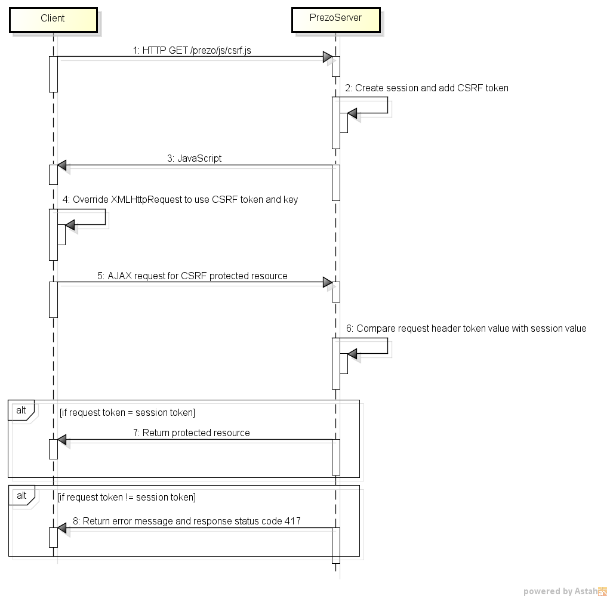

# Presentation Server (PrezoServer) Specification Version 1.0

#### Copyright 2014 Kevin Johnston (kevin@prezoserver.org)

## 1.0 Definitions

#### 1.1 Application

Within the context of the presentation tier, "presentation application" or simply "application" refers to the resources that are necessary for building the user interface.

#### 1.2 Server

A server is defined to be an instance of a web or application server containing a document root directory, designated for a single presentation application, that meets all of the requirements of this specification.

#### 1.3 Client

A client receives content from the presentation server over HTTP and renders the user interface. 

#### 1.4 File

Files are the server resources which define or control the user interface. Files may be implemented on the server in one of the following ways:

* Literal - files which exist on the server's file system and directly produce some aspect of the user interface.

* Virtual - files which do not exist on the server's file system but produce some aspect of the user interface through a server side mechanism. For example, a Java Servlet or an Apache URL Rewrite that produces the content of a JavaScript file.

* Wrappers - files which exist on the file system which defer producing some aspect of the user interface to another file or server side resource via Server Side Includes (SSI).  For example, a JavaScript file which uses SSI to include another file (e.g. a PHP, JSP, ASP, or other dynamically processed file) to produce its content.

## 2.0 Requirements

#### 2.1 Document Root

The document root directory should serve content for only one application.

#### 2.2 Server Side Includes (SSI)

The server must enable SSI for all files with a ".html" extension. Additional SSI rules for other file extensions may be created per implementation in order to facilitate meeting the requirements of this specification.

SSI must be configured to execute relative to the server's document root directory.

The only SSI directive that is to be used within an application is the include directive. The virtual path is with respect to the server document root and has the following form:

<!--#include virtual="/<directory>/<file>" -->

#### 2.3 Directory Structure
The application root document directory will contain a folder named "prezo". This directory contains the implementation specific files required to meet this specification.  Actual application content should not be placed in this directory.  When packaging an application to deploy on another PrezoServer implementation the prezo directory should not be included. 

The prezo folder will have the following subdirectories and files:

<pre>
/
|-- prezo/
|     |-- fragments/
|     |    |-- base.html
|     |-- js/
|     |    |-- prezo.js
|     |    |-- csrf.js
|     |-- support/
|     |    |-- fragments/
|     |    |-- js/
</pre> 
 
The following files may be implemented as literal, virtual, or wrapper files:
    /<document root>/prezo/fragments/base.html
    /<document root>/prezo/js/prezo.js
    /<document root>/prezo/js/csrf.js
    
Wrapped files are intended to be placed in the corresponding directory under support.

Regardless of how the files are implemented the following URLs should result in an HTTP response with status code 200 (OK) when accessed by a client:

http(s)://\<server\>:\<port\>/\<document root\>/prezo/fragments/base.html  
http(s)://\<server\>:\<port\>/\<document root\>/prezo/js/prezo.js  
http(s)://\<server\>:\<port\>/\<document root\>/prezo/js/csrf.js  

The directory /\<document root\>/prezo/support/ and any of its subdirectories and files should not be accessible from a client. Any attempt to access its subdirectories and files should result in an HTTP response with status code of 404 (Not Found).

#### 2.4 base.html

The base.html file exists as either a static, virtual, or wrapper file at /\<document root\>/prezo/fragments/base.html and is accessible by a client accessing the URL http(s)://\<server\>:\<port\>/\<document root\>/prezo/fragments/base.html. 

The base.html file contains a base HTML tag which specifies the base href URL. The URL is to be set to http(s)://\<server\>:\<port\>/\<document root\>. If using a reverse proxy server in combination with the presentation server the URL should be set to the URL of the reverse proxy server, proxy server port, and proxy server path.

#### 2.5 prezo.js

The prezo.js file exists as either a static, virtual, or wrapper file at /\<document root\>/prezo/js/prezo.js and is accessible by a client accessing the URL http(s)://\<server\>:\<port\>/\<document root\>/prezo/js/prezo.js.

This file defines a JavaScript name space and constant for the document root directory of the application. The name space variable and constant is "prezo.application.DOCROOT". If using the presentation server directly (i.e. no reverse proxy server) the variable should be set to "/". For servers that support the notion of web contexts the variable should be set to "<contextPath>/". If a reverse proxy server is being used then the variable should be set to the virtual directory by which the reverse proxy server proxies requests to the presentation server. 

Example 1 (directly accessing presentation server):  
Assuming the URL resembles something like http(s)://server.presentation.com[:\<port\>]**/**   
prezo.application.DOCROOT = "**/**";

Example 2 (directly accessing presentation server via a context path):  
Assuming the URL resembles something like http(s)://server.presentation.com[:\<port\>]/**contextPath/**          
prezo.application.DOCROOT = "**contextPath/**";  

Example 3 (using a proxy server):  
Assuming proxy resembles something like:  
http(s)://server.proxy.com[:\<port\>]/**application/** -> http(s)://server.presentation.com[:\<port\>]/  
prezo.application.DOCROOT = "**application/**";

#### 2.6 csrf.js

The csrf.js file exists as either a static, virtual, or wrapper file at /<document root>/prezo/js/csrf.js and is accessible by a client  accessing the URL http(s)://\<server\>:\<port\>/\<document root\>/prezo/js/csrf.js.

The csrf.js file, when included by the client, is to override the XMLHttpRequest object and inject the appropriate server side CSRF variables into the XMLHttpRequest object. The client makes all requests to get or modify data through AJAX. When the request is processed by the presentation server (which is implemented with an application server technology) the server is able to determine if the request has the appropriate CSRF variables and either allow or reject the AJAX request. If the server detects a potential CSRF issue it should return a response body containing "Potential CSRF Attack Detected" with a HTTP status code of 417 to represent this condition. The client, upon detecting the status code, may display appropriate guidance to the user.

The following sequence diagram illustrates the intended CSRF protection process for a PrezoServer.

